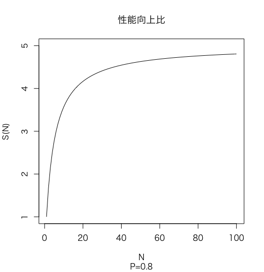

<!--
class: slides
-->

# 6.2 並列処理プログラム作成の困難さ

## 並列処理を行うモチベーション

- 優れた性能を実現したい
- 優れたエネルギー効率を達成したい

## 課題

- スケジューリング
- 作業の分割
- 各作業者の間での負荷の平準化

- 同期に時間がかかる
- 計算結果のすり合わせに時間がかかる

---

# 6.2 並列処理プログラム作成の困難さ

## Amdahlの法則

$$ S(N) = \frac{1}{ (1-P) + \frac{P}{N} } $$

<small class="mid">

$S(N)$: 速度向上比　$N$: 改善量(プロセッサ数など)
$P$: 影響を受ける時間の割合(並列計算可能な時間の割合) ($0 \leq P \leq 1$)
</small>

$\lim\limits_{N \to \infin}S(N)=\frac{1}{1-P}$ なので, プロセッサをたくさん増やしても, 速度向上比は**並列化できない逐次処理に制約される**ことになる

</img>

---

# 6.2 並列処理プログラム作成の困難さ

## スケーリングの種類

- **強いスケーリング**
問題の規模を固定したままで達成される速度向上. メモリ量は$\frac{M}{P}$.

- **弱いスケーリング**
プロセッサ数の増大に比例して問題の規模も大きくした場合に達成される速度向上. メモリ量は$M$.
弱いスケーリングのほうが達成が簡単そう. 最下位レベルのキャッシュに乗り切らなくて性能が悪化することもあるので注意 (5章 記憶階層)

<small class="mid">

$M$: RAM上のワーキングセット, $P$: プロセッサ数

</small>

---

# 6.2 並列処理プログラム作成の困難さ

## 負荷平準化の必要性

各プロセッサの負荷を平準化しないと, 全体の処理時間が一番遅いプロセッサに制約される

$$ T_{total}(N) = \textrm{max}(T_{parallel}) + T_{serial} $$

<small class="mid">

$T_{total}$: 実行時間　$T_{parallel}$: 並列処理における各プロセッサの実行時間の集合　$T_{serial}$: 逐次処理の実行時間

</small>
